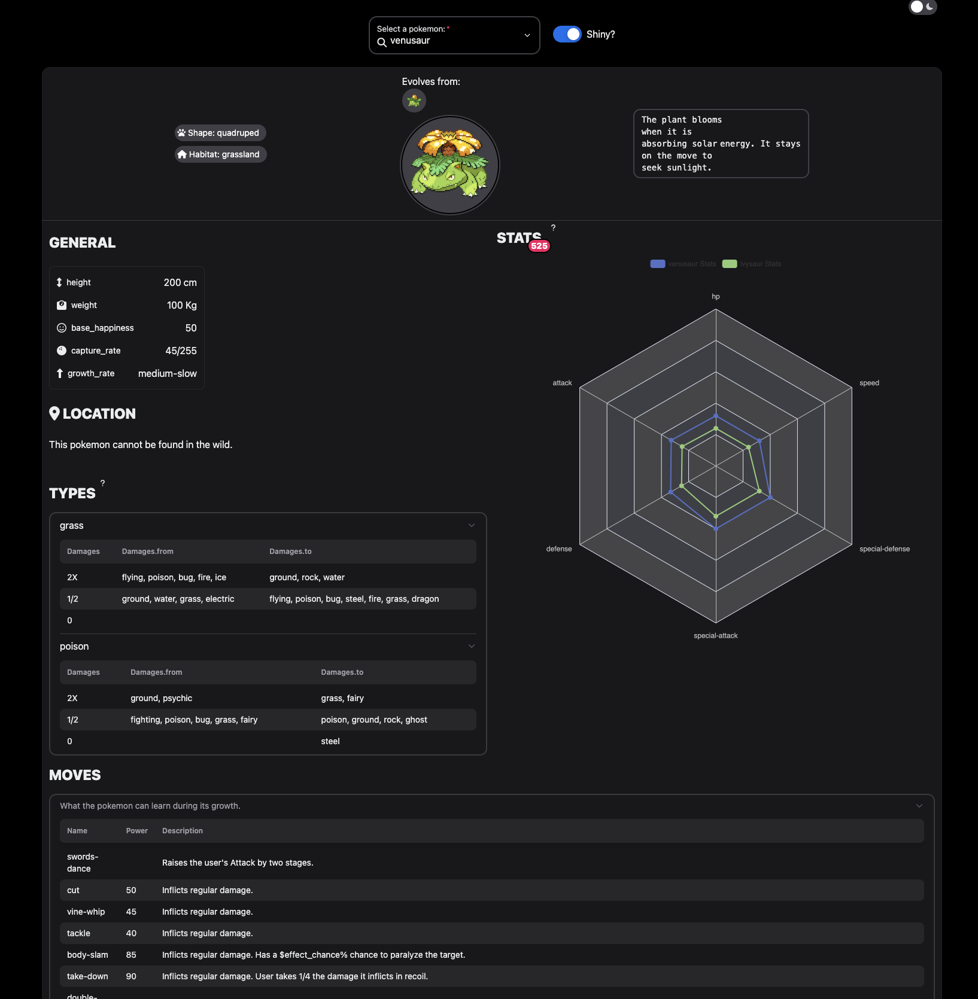

# shinyNextUI

<!-- badges: start -->
  [](https://github.com/RinteRface/shinyNextUI/actions/workflows/R-CMD-check.yaml)
  <!-- badges: end -->

The goal of `{shinyNextUI}` is to provide a wrapper around the
NextUI React [library](https://nextui.org/).



## Installation

You can install the development version of `{shinyNextUI}` from [GitHub](https://github.com/) with:

``` r
# install.packages("devtools")
devtools::install_github("RinteRface/shinyNextUI")
```

## Example

To quickly get started with any example:

``` r
library(shinyNextUI)
# Get all examples
get_examples()
# Select an example and run the app
run_example("card")
```

## Developer

Within the `js` folder, run `npm install`. Then, for each change:

```shell
# Update CSS
npx tailwindcss -i ./src/input.css -o ./src/output.css --watch

# Change JS files
yarn webpack
```
