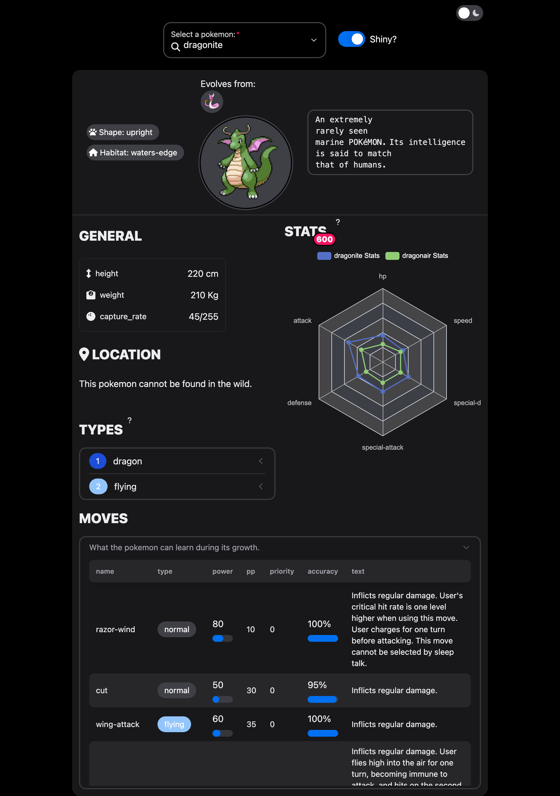

# shinyNextUI

<!-- badges: start -->
  [](https://github.com/RinteRface/shinyNextUI/actions/workflows/R-CMD-check.yaml)
  <!-- badges: end -->

The goal of `{shinyNextUI}` is to provide a wrapper around the
NextUI React [library](https://nextui.org/).



The app corresponding to the above screenshot is located [here](https://github.com/RinteRface/shinyNextUI/tree/main/inst/showcase).

## Notes

`{shinyNextUI}` is currently in alpha. Please carefully look at the current [issues](https://github.com/RinteRface/shinyNextUI/issues).

The current roadmap:

- Provide more aliases to match Shiny's vanilla notations like `selectInput`, ...
- Refine the navbar template.
- Allow to dynamically create [themes](https://nextui.org/docs/customization/theme).

`{shinyNextUI}` leverages tailwind css and some [rules](https://github.com/RinteRface/shinyNextUI/blob/main/js/src/output.css) have already been pre-compiled to use in the various [examples](https://github.com/RinteRface/shinyNextUI/tree/main/inst/examples). If you need custom styles, you can use the [`{windy}`](https://github.com/devOpifex/windy) package.

## Installation

You can install the development version of `{shinyNextUI}` from [GitHub](https://github.com/) with:

``` r
# install.packages("devtools")
devtools::install_github("RinteRface/shinyNextUI")
```

## Example

To quickly get started with any example:

``` r
library(shinyNextUI)
# Get all examples
get_examples()
# Select an example and run the app
run_example("card")
```

## Developer

`{shinyNextUI}` leverages [tailwind](https://tailwindcss.com/) for the CSS management and [webpack](https://webpack.js.org/) as JS bundler and a mix between `{shiny.react}` and `{reactR}` for components and input management.

Within the `js` folder, run `npm install`. Then, for each change:

```shell
# Update CSS
npx tailwindcss -i ./src/input.css -o ./src/output.css --watch

# Change JS files
yarn webpack
```
